## EDA Summary — FRC Match Predictor Project
# Data Cleaning & Filtering

The raw TBA data includes many inconsistencies:

1. Incomplete Seasons

- Pre-2016: Auto/teleop/endgame scoring was inconsistently logged.
- 2021: Season cancelled due to COVID, matches are synthetic and unusable.

2. Offseason Events

Offseason competitions (TBA event_type = 99) have   

- Experimental rulesets
- Missing score details
- Unpredictable performance variance

These were removed using a full events.csv merge.

3. Faulty Event Data

Some events reported:

- Missing or malformed score breakdowns
- Impossible/empty values (e.g., auto = teleop = total = 0, but match exists)

These were excluded with modular filters in cleaning.py.

After cleaning, we retain ≈132k high-quality matches from 2016–2025.

# Key EDA Findings
1. Clear Correlation Between Score Advantages and Winning

Across auto, teleop, and endgame, we observe the expected trend:

- A larger point advantage -> higher probability of winning. (Duh)

However, each phase behaves differently.

2. Auto Advantage vs Win Probability — Linear Trend

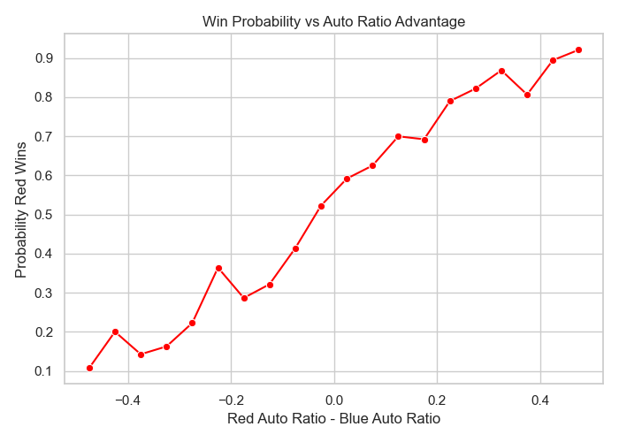
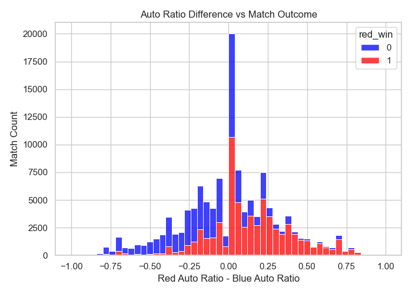

Auto advantage (red_autoRatio - blue_autoRatio) produces a steadily increasing linear curve.

Interpretation:

- Auto matters regardless of magnitude.
- Even a small edge consistently boosts win probability.

Overall this makes sense since auto points are uncontested and offer highvalue scoring windows.

3. Teleop Advantage vs Win Probability — Sigmoid Curve

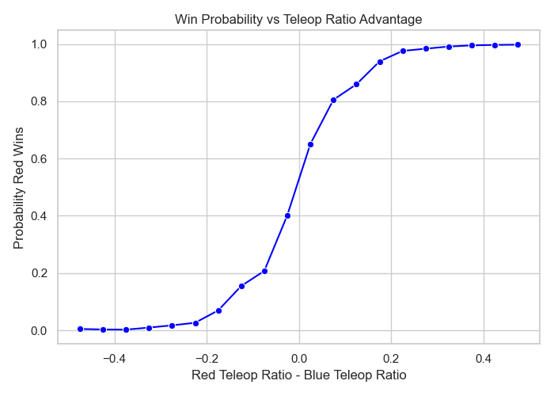
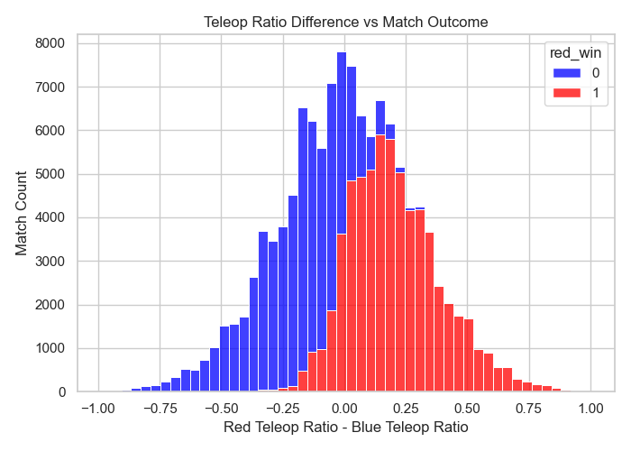

Teleop advantage produces a sigmoid-shaped relationship:

- Small teleop differences have weak predictive power
- Moderate differences rapidly increase win rate
- Large teleop advantages nearly guarantee a win

Why?
Teleop contributes the most total points, so:

- Tiny differences are noisy and non-predictive
- Medium differences reflect genuine offensive superiority
- Large teleop dominance overwhelms other teams

This insight makes teleop the strongest long-term predictive feature.

4. Endgame Advantage — Highly Noisy

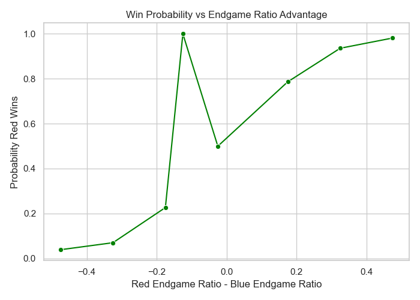
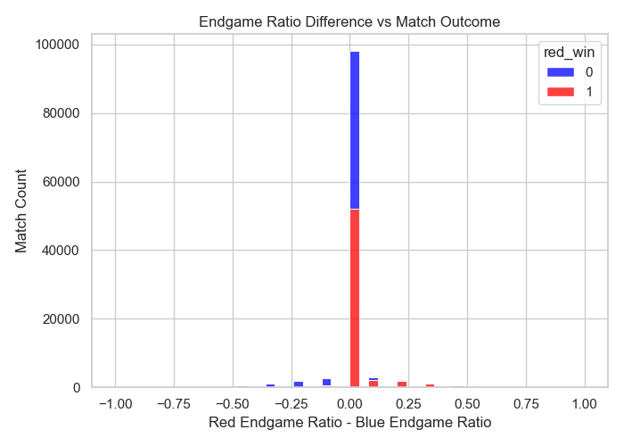

What is shows
- Very wide variance
- Sudden spikes and drops
- Weak monotonicity

Why?
Endgame scoring varies dramatically by year:

- 2016 had tower scaling
- 2018 had climb+levitate
- 2022 had traversal climb
- 2023 had charge station
- 2024 had climb plus additional task
- 2025 had modifiable endgame

Thus, endgame behavior is solution specific, noisy, and does not generalize well.

6. Event Competitiveness & Stability

Computed competitiveness = event_mean / yearly_mean across:

- auto
- teleop
- endgame
- totalMinusFouls

Two major observations:

**A. Competitiveness Distribution**
Most events cluster tightly around 1.0:

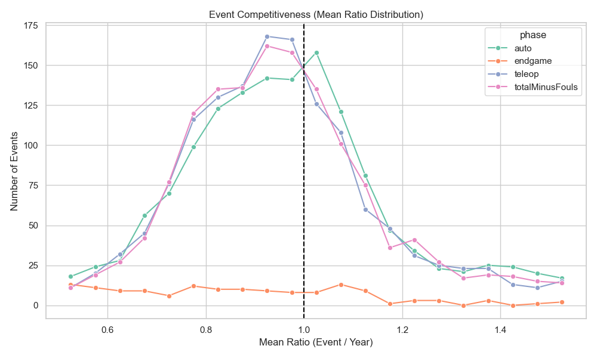 
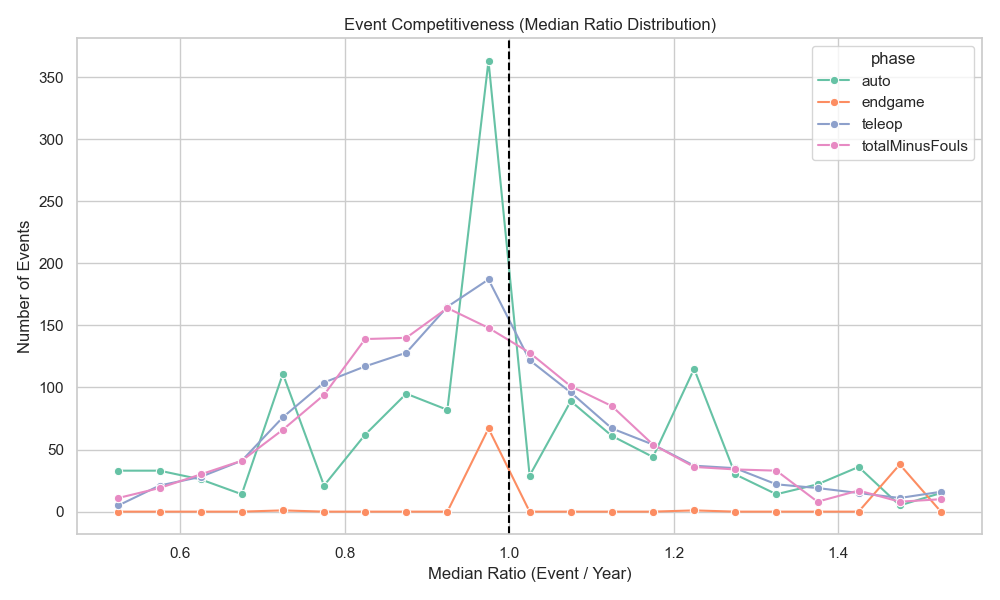 
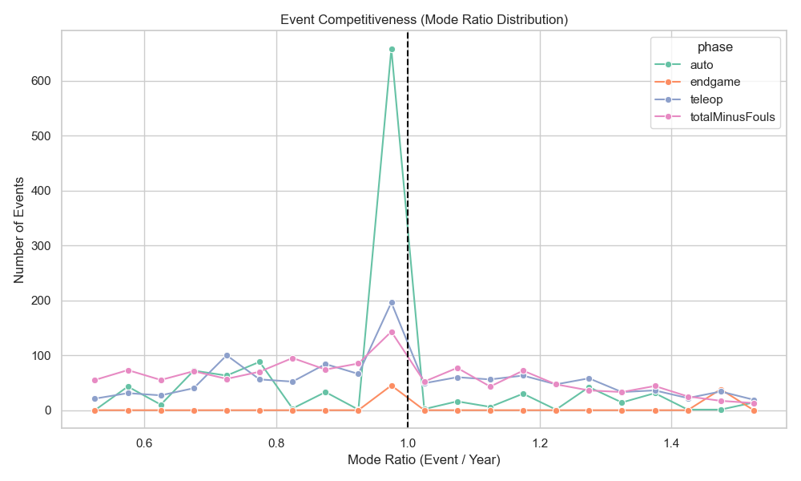

Meaning:
- Events are generally balanced relative to their year.
- Only a few “extreme” events have very high or very low scoring environments.

**B. Stability Over Years**

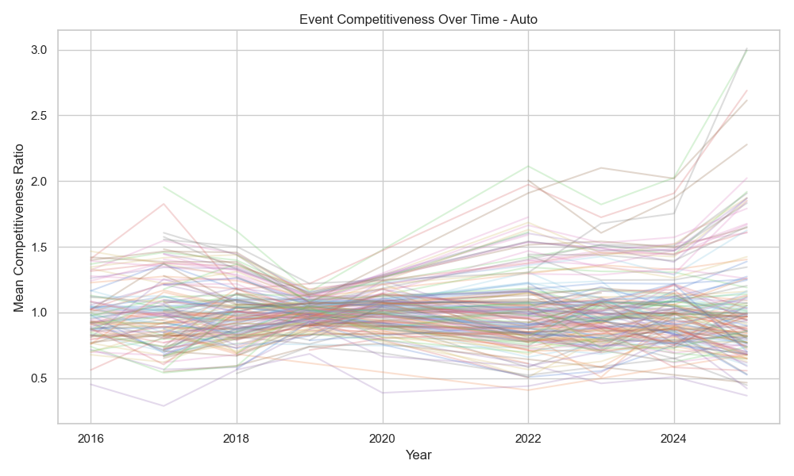 
 
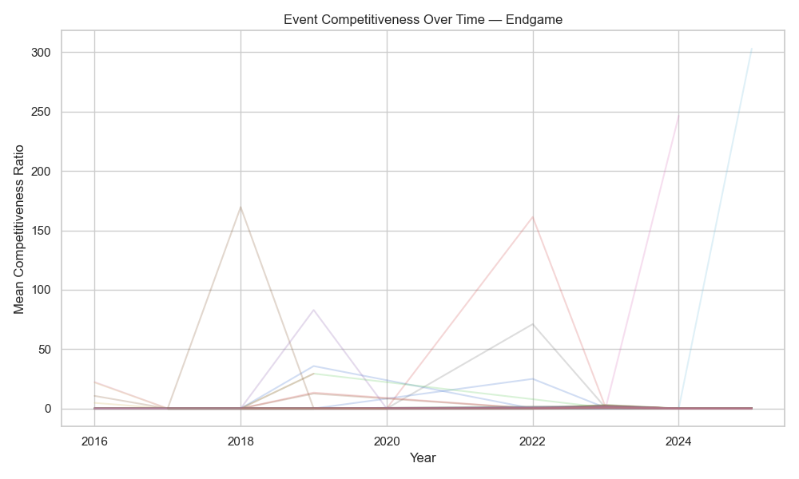 
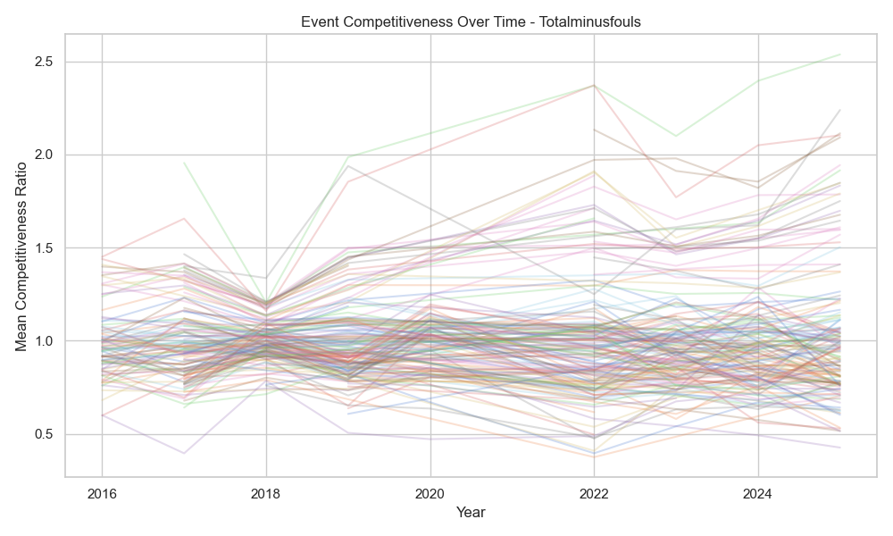

Shows that:
- Most events follow a consistent scoring profile across time (≈0.8–0.9 correlation stability)
- 2018 stands out as an anomaly where nearly all event scores collapse toward a single convergence point.

2018 is likely due to:
- The "Power Up" game having unusually uniform scoring structures
- Balanced autonomous cube scoring and balanced scale/switch scoring
- Very few ways to create extreme score differentials across matches

Thus 2018 is a meaningful but explainable anomaly.

7. Alliance Bias

A weird observation
> Red alliance wins slightly more often than blue.

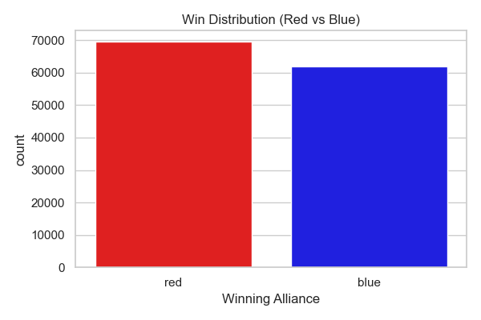

However this can be slightly explained:

- Red is the "higher seed" in playoffs
- Due to random chance Qualification schedules sometimes give red stronger matchups

This bias is small but statistically persistent.

# Remaining Issues / Open Questions

Teleop appears strongest statistically should features be normalized by year or by possible max score?
- I am currently normalizing by taking the max observed teleop that year and setting the match teleop score as a ratio compared to this max
- However, this might not be the only method as perhaps some years a log could be better

Auto and endgame vary dramatically by year should the model include year specific feature embeddings?
- That seems like a lot of complexity and effort for maybe no value at all
- Using just the raw values seem to have great correlation results so far
- Furthermore, I want this predictor to work in future years without needing to spend a lot of effort to update the features

Team performance varies over the season especially within a single event should we incorporate:
- rolling averages?
- matches in last X events?

Foul points are highly noisy—should they be excluded or down weighted?
- Originally I thought it would be an interesting feature
- Since if a team is known for creating penalities, that would provide the other alliance points

The Stability/Competitiveness seem to have some good correlations, however I am still not satisfied with some of the results and want to refine and tweak it.
- Such as how to use these competiveness with winrate. An above average team competing with lower ranked teams result in higher winrate at an event.
- Should I normalize winrate based on competiveness?
- Should I do some normalization on winrate based on year since the game changes each year?

I also want to explore teams by region/state/country
- Is there correlation between median income and performance?
- Are there higher performing teams in similar places (Ex: Some teams are partnered with each other and have mentors across multiple teams)
- Does distance from event competing at make a difference?

# Intial Feature Ideas
Based on the EDA, the following features appear promising:

Match-Level Red vs Blue Advantage Features
- Auto ratio difference
- Teleop ratio difference
- Endgame ratio difference
- Total score minus foul score difference
- Penalty difference
- Perhaps some aggregation of all of these for "Red vs Blue Advantage"

## Team-Level Features

For each individual team:
- Average auto/teleop/endgame score contribution
- Team winrate
- Team consistency/stability
- Year to year performance change
- Performance at specific event types (district/regional/champs)

## Event-Level Features
- Event competitiveness score
- Event stability score
- Country/state/region of event
- Whether event is district vs regional vs championship
- Qualification vs Playoffs

These derived features can help a classifier understand the context in which matches occur.

# Conclusion

The cleaned FRC dataset is:
- Large enough for a predictive classifier
- High dimensional, allowing many engineered features
- Structured with some clear win correlated signals

The EDA shows strong relationships between scoring phases and win probability, consistent event competitiveness, and meaningful year to year variations that models can exploit.