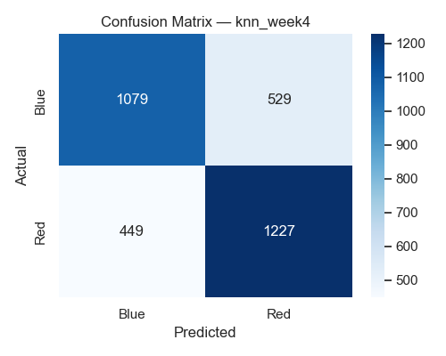
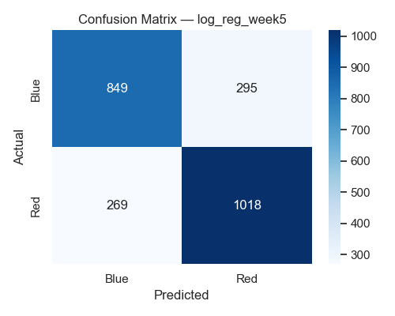
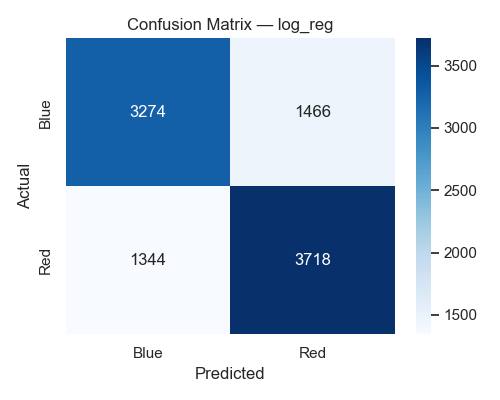
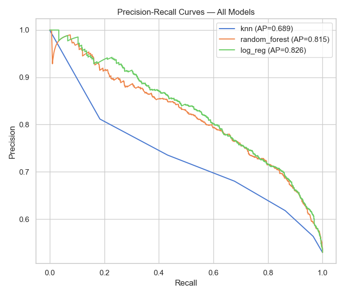
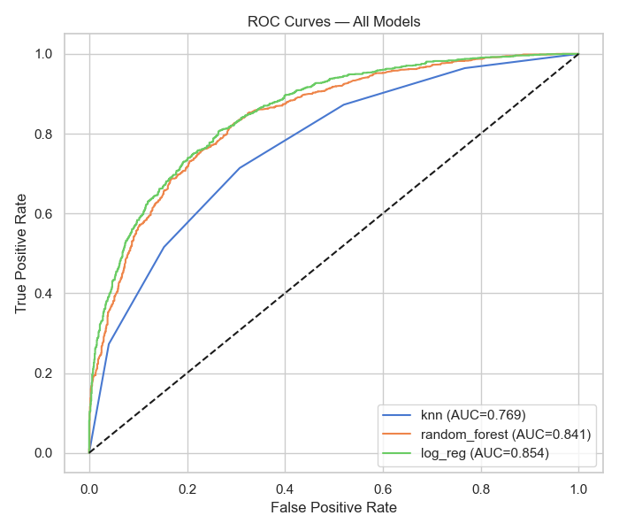
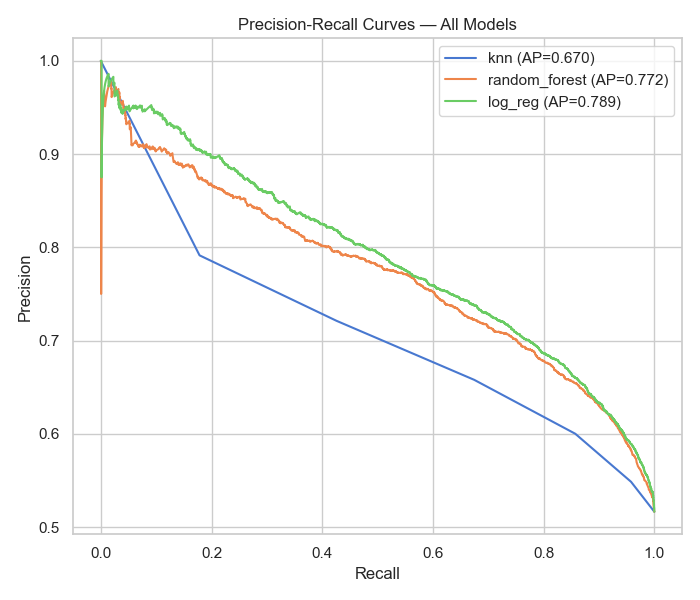
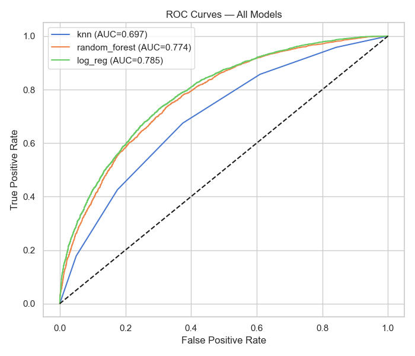
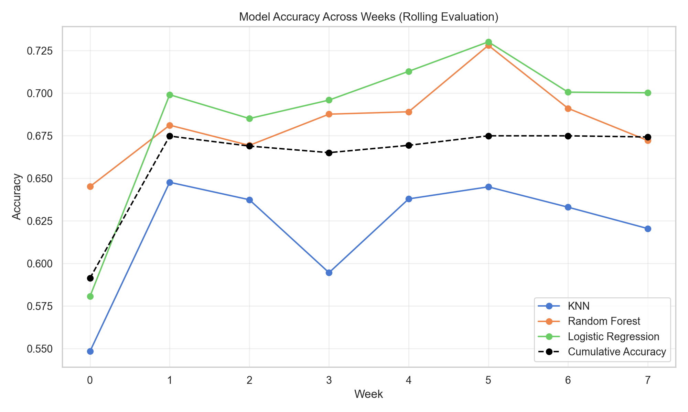

## First Draft - FRC Match Predictor Project
Baseline Modeling, Feature Engineering, & Rolling Evaluation

# 1. Feature Engineering & Model Development
Following the initial EDA, I iteratively built and expanded the feature set used for predicting which alliance (red or blue) would win an FRC match. The feature engineering process evolved across several stages:

**A. Basic Score Normalization**
The first baseline used only normalized scoring components:

- Total
- Auto
- Teleop
- Endgame
- Fouls (later removed)

These were scaled by the maximum observed value at the 95th percentile per year to reduce cross season variance.

**B. Phase Disparity Features**
Next, I created difference based features such as:

- total_disp
- auto_disp 
- teleop_disp 
- endgame_disp
- foul_disp

**C. Top-K, Min/Max, and Variability Features**
To capture alliance synergy and extremes:

- max contribution per alliance
- top-2 average contribution
- standard deviation
- minimum contribution

These helped encode team imbalance, which strongly correlates with match outcomes alliances with one elite team and two average teams behave differently than three balanced teams.

**D. Rolling Last 5 Matches Features**
I implemented a match history window per team using chronological actual_time ordering:

- avg_auto_5
- avg_teleop_5 
- avg_total_5
- avg_winrate_5

**E. Categorical Features**
Added categorical indicators for matches:

- is_qm (qualification)
- is_sf (semifinals) Converting previous years quarterfinals to semifinals
- is_f (finals)
- event week
- year

**What I removed**
After running feature importance on Logistic Regression, Random Forest, and KNN, I removed:

- week
- year
- endgame features
- foul features

These contributed noise, instability, or misleading correlations (especially fouls, which were originally assigned to the wrong alliance direction but still were noisy even after fixing).

# 2. Modeling Approaches
I built several models to establish a baseline and benchmark:

**Heuristics**
I used many of the basic stats such as teleop and auto to compare if Red > Blue then vote Red else vote Blue. I even did a combined heurstic of the 5 stats and did a voting system where if it was >= 3 it voted Red, else vote Blue.

Surprisingly, these performed above random and in some cases outperformed KNN.

**KNN**
Useful as a simple non-parametric baseline but:

- inconsistent
- sensitive to feature scaling
- struggled with new teams and early-season matches
- significantly worse than tree based or linear models

**Random Forest** 
Provided:

- good mid season accuracy
- interpretable feature importance
- strong performance on nonlinear relationships

RF consistently outperformed KNN and matched LR in early weeks but suffered slightly from season to season variance.

**Logistic Regression**
This model emerged as the strongest overall:

- most stable across events
- highest accuracy from Week 2 onward
- top performance in championships
- most consistent across regions and event types

Feature importance also helped prune poor contributors for cleaner models.

# 3. Model Evaluation

**A. Confusion Matrices (Week 0 -> Week 7)**

I generated confusion matrices for several weeks to visualize prediction behavior:

Overall Confusion Matrix from Weeks 3-7:

However, because predicting Red win is just as important as predicting Blue win, my final evaluation metric ended up being Accuracy instead of traditional recall, precision, and F1.

**B. ROC & PR Curves**
Overall curves across the whole test distribution show:

- LR and RF has the highest AUC (close to 0.8+)
- KNN hovers near the threshold of usability

Week 5 graphs:

Week 3-7 overall predictions: 

 

**C. Event Level Accuracy**
Across 2025 events:

- Logistic Regression consistently achieves 70-82% accuracy
- Random Forest 65-78%
- KNN 55-65%

This ranking holds in:
- regionals
- districts
- district championships
- world championship divisions

Weak events (few matches) are highly variable but consistent with small sample noise.

**D. Rolling Weekly Evaluation**
To simulate realistic prediction (no future leakage), I implemented a rolling week by week training and testing loop:
- Train on all prior weeks
- Test on the current week
- Update rolling team stats
- Repeat

This produced realistic accuracies:
- early weeks: ~60-67%
- mid season weeks: ~70-82% (LR strongest)
- championship: ~67-80%

Running this took substantial compute time, 30 minutes for 8 sets of retraining and evaluating, meaning a match by match rolling evaluation would be far slower, so for future testing I might implement these steps:

- batch predictions every 10-20 qualification matches
- then evaluate playoffs separately
- then move to the next event/week

# 4. Strengths, Weaknesses, and Next Steps
Strengths

- Strong mid season prediction accuracy
- Rolling evaluation prevents leakage
- Robust and interpretable feature set
- Logistic Regression provides stable performance across all event types
- Successfully removed noisy features (year, week, fouls, endgame)

Weaknesses

- Early season performance remains volatile (to be expected since the competition changes each year, we have a cold start problem of current year statistics)
- Rolling evaluation is slow with large models
- Some features (like rolling last 5 match stats) require computationally heavy truncation each week
- Models do not yet incorporate event competitiveness, postal/geographical data, or multi year features

**Plans for the future**

More Feature Engineering

- event competitiveness
- event scoring stability
- team stability / consistency
- postal code, geographical clustering (without leakage)
- improved handling for rookies
- alternative temporal windows (EMA instead of fixed last 5)

More Models

- Gradient Boosting (XGBoost, LightGBM)
- SVM
- I am thinking of adding more to this list, but I would need to do more research before blindly adding them in.

Better Rolling Evaluation

- batch match-level rolling (10 20 matches at a time)
- playoff only vs qualification only separation
- more detailed event level error analysis

# Additional notes
I am currently comparing my accuracy metrics against the publicly available predictions from Statbotics, which provides event level accuracy based on their EPA system. Their reported accuracies typically range from 70% to 95%, which is higher than the 65% to 80% accuracy achieved by my models. A few of my event level results come reasonably close-often within several percentage points but overall the EPA system still outperforms my current approach.

Even so, I am satisfied with this first draft, as it is competitive despite not using any of Statbotics’ specialized, year tailored model structure. While it is theoretically possible to decompose auto, teleop, endgame, and other point categories into fully normalized cross-year metrics, doing so without introducing leakage or relying on year specific knowledge is difficult. Since this project intentionally uses past years’ data without custom normalization for each season’s scoring system, some performance gap compared to EPA is expected.

# Conclusion
The first draft establishes:
- A fully working FRC match predictor
- Solid baseline models
- Effective feature engineering
- Leakage free rolling evaluation
- Clear evidence that Logistic Regression is currently the best model
- Multiple opportunities for improvement for the future

With additional feature engineering and model refinement, I expect further improvements in mid season and championship prediction accuracy.

